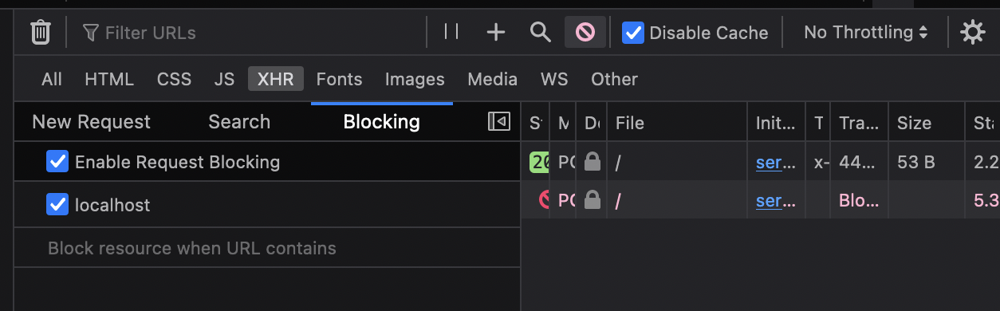
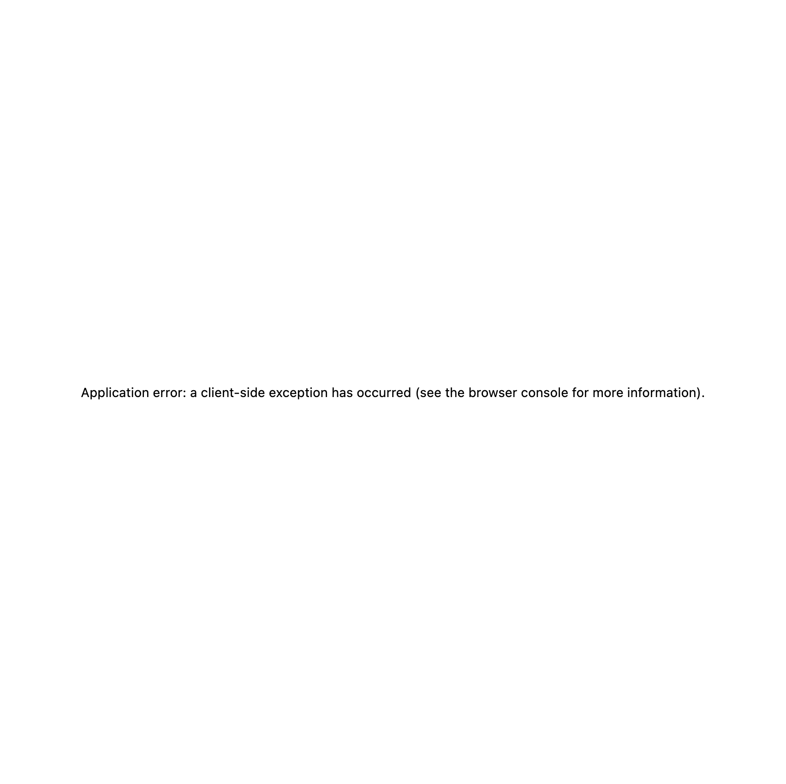

# Reproduction steps

1. `npm i`.
2. `npm run dev`.
3. Open `http://localhost:3000` in Firefox.
4. Open the dev tools, and click on request blocking.
5. Add `localhost` as blocking pattern.

6. Click the button on the page.

* **Expected:** Nothing happens (there is a catch clause).
* **Actual:** A client error next message is displayed.
